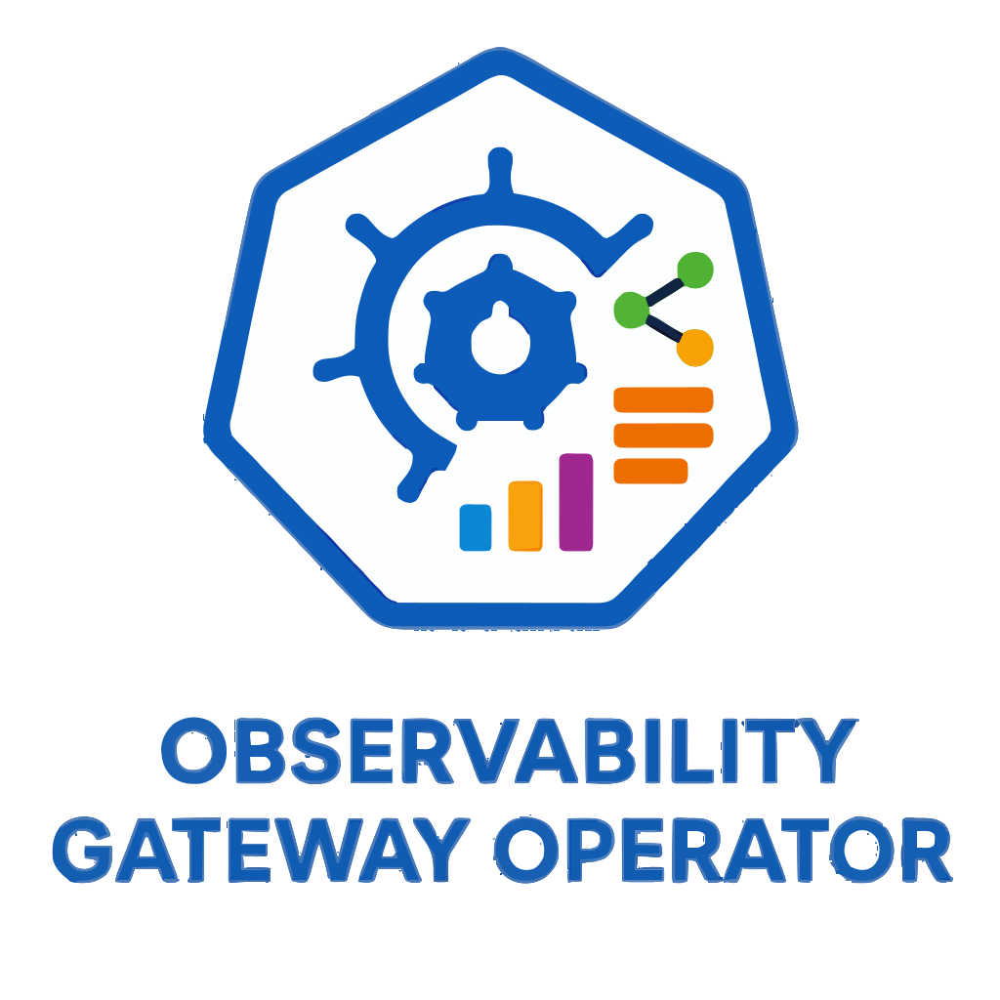

# Observability Gateway Operator
This repository defines the `ObservabilityGateway` CRD and its Kubernetes operator, offering a declarative way to provision and manage multi‑class OpenTelemetry ingestion gateways with priority‑aware collectors.

<p align='center'>
    
</p>

## Description
Modern observability systems often need to handle telemetry data with different levels of importance: critical traces and metrics should get low-latency, high-availability treatment, while bulk or debug data can be processed with fewer resources.

This operator declares a single `ObservabilityGateway` custom resource that automatically provisions **separate collector tiers** (e.g., gold, silver, bronze) — each with its own:
- Deployment (dedicated replica count and resources)
- Service (independent endpoints)
- Shared configuration from a ConfigMap

Built for use with a custom priority-queue OpenTelemetry collector (`alexandrosst/prioqueue-collector`), it gives a declarative way to run a differentiated ingestion control plane.

Perfect for:
- Ensuring critical application telemetry gets priority processing
- Isolating noisy or low-value data streams
- Scaling ingestion independently per priority class

No more manual Deployments per tier — just declare the desired state, and the operator keeps everything in sync.

## Features
- Single CR manages multiple priority classes
- Automatic creation/deletion of per-class Deployments and Services
- Default OTLP ports (4317/gRPC, 4318/HTTP, 8888/metrics)
- Garbage collection when classes are removed
- Full owner references for clean cleanup

## Prerequisites
- go version v1.24.6+
- docker version 17.03+.
- kubectl version v1.11.3+.
- Access to a Kubernetes v1.11.3+ cluster.

## Quick Install (for users)
To get started, install the `ObservabilityGateway` Custom Resource Definition (CRD) and the Operator that manages it.
1. Install the CRD

    This registers the `ObservabilityGateway` resource type in your cluster:
    ```bash
    kubectl apply -f https://raw.githubusercontent.com/alexandrosst/observability-gateway-operator/main/config/crd/bases/observability.x-k8s.io_observabilitygateways.yaml
    ```

2. Install the Operator

    This deploys the controller that reconciles `ObservabilityGateway` resources:
    ```bash
    kubectl apply -k github.com/alexandrosst/observability-gateway-operator/config/default
    ```

3. Verify the installation

    Once applied, confirm that the operator is running:
    ```bash
    kubectl get pods -n observability-system
    ```
    You should see the controller pod in a Running state.

## Usage
To deploy an `ObservabilityGateway`, start by creating a dedicated namespace for your ingestion components:
```bash
kubectl create namespace observability
```

Next, apply the shared OpenTelemetry configuration that will be referenced by your gateway and its collectors:
```bash
kubectl apply -f https://raw.githubusercontent.com/alexandrosst/observability-gateway-operator/v0.1.1/examples/otel-configmap.yaml
```

Finally, deploy your multi-class ObservabilityGateway resource. This will trigger the operator to provision the appropriate collectors and routing logic based on your declarative spec:
```bash
kubectl apply -f https://raw.githubusercontent.com/alexandrosst/observability-gateway-operator/v0.1.1/examples/gateway.yaml
```

To verify that the gateway and its collectors have been created successfully, you can inspect the deployments and services in the namespace:
```bash
kubectl get deployments,services -n observability
```

As expected output, you should see:
```bash
kubectl get deployments -n observability
NAME                              READY   UP-TO-DATE   AVAILABLE   AGE
prio-ingestion-gateway-gold       3/3     3            3           1m
prio-ingestion-gateway-silver     2/2     2            2           1m
prio-ingestion-gateway-bronze     1/1     1            1           1m
```

```bash
kubectl get services -n observability
NAME                              TYPE        CLUSTER-IP      EXTERNAL-IP   PORT(S)                          AGE
prio-ingestion-gateway-gold       ClusterIP   10.96.x.x       <none>        4317/TCP,4318/TCP,8888/TCP       1m
prio-ingestion-gateway-silver     ClusterIP   10.96.y.y       <none>        4317/TCP,4318/TCP,8888/TCP       1m
prio-ingestion-gateway-bronze     ClusterIP   10.96.z.z       <none>        4317/TCP,4318/TCP,8888/TCP       1m
```

## Development
1. Build & run locally (great for development):
```bash
make install   # Install CRD locally
make run       # Run operator on your machine
```

2. Build & push image
```bash
IMG=alexandrosst/observability-gateway-operator:v0.1.1 make docker-build docker-push
```

3. Test full installation from your repo
```bash
kubectl apply -k github.com/alexandrosst/observability-gateway-operator/config/default
```

## Uninstallation
```bash
kubectl delete -k https://github.com/alexandrosst/observability-gateway-operator/config/default?ref=v0.1.1
kubectl delete crd observabilitygateways.observability.x-k8s.io
```

### To Deploy on the cluster
**Build and push your image to the location specified by `IMG`:**

```sh
make docker-build docker-push IMG=<some-registry>/observability-gateway-operator:tag
```

**NOTE:** This image ought to be published in the personal registry you specified.
And it is required to have access to pull the image from the working environment.
Make sure you have the proper permission to the registry if the above commands don’t work.

**Install the CRDs into the cluster:**

```sh
make install
```

**Deploy the Manager to the cluster with the image specified by `IMG`:**

```sh
make deploy IMG=<some-registry>/observability-gateway-operator:tag
```

> **NOTE**: If you encounter RBAC errors, you may need to grant yourself cluster-admin
privileges or be logged in as admin.

**Create instances of your solution**
You can apply the samples (examples) from the config/sample:

```sh
kubectl apply -k config/samples/
```

>**NOTE**: Ensure that the samples has default values to test it out.

### To Uninstall
**Delete the instances (CRs) from the cluster:**

```sh
kubectl delete -k config/samples/
```

**Delete the APIs(CRDs) from the cluster:**

```sh
make uninstall
```

**UnDeploy the controller from the cluster:**

```sh
make undeploy
```

## Project Distribution

Following the options to release and provide this solution to the users.

### By providing a bundle with all YAML files

1. Build the installer for the image built and published in the registry:

```sh
make build-installer IMG=<some-registry>/observability-gateway-operator:tag
```

**NOTE:** The makefile target mentioned above generates an 'install.yaml'
file in the dist directory. This file contains all the resources built
with Kustomize, which are necessary to install this project without its
dependencies.

2. Using the installer

Users can just run 'kubectl apply -f <URL for YAML BUNDLE>' to install
the project, i.e.:

```sh
kubectl apply -f https://raw.githubusercontent.com/<org>/observability-gateway-operator/<tag or branch>/dist/install.yaml
```

### By providing a Helm Chart

1. Build the chart using the optional helm plugin

```sh
kubebuilder edit --plugins=helm/v2-alpha
```

2. See that a chart was generated under 'dist/chart', and users
can obtain this solution from there.

**NOTE:** If you change the project, you need to update the Helm Chart
using the same command above to sync the latest changes. Furthermore,
if you create webhooks, you need to use the above command with
the '--force' flag and manually ensure that any custom configuration
previously added to 'dist/chart/values.yaml' or 'dist/chart/manager/manager.yaml'
is manually re-applied afterwards.

## Contributing
// TODO(user): Add detailed information on how you would like others to contribute to this project

**NOTE:** Run `make help` for more information on all potential `make` targets

More information can be found via the [Kubebuilder Documentation](https://book.kubebuilder.io/introduction.html)

## License

Copyright 2026.

Licensed under the Apache License, Version 2.0 (the "License");
you may not use this file except in compliance with the License.
You may obtain a copy of the License at

    http://www.apache.org/licenses/LICENSE-2.0

Unless required by applicable law or agreed to in writing, software
distributed under the License is distributed on an "AS IS" BASIS,
WITHOUT WARRANTIES OR CONDITIONS OF ANY KIND, either express or implied.
See the License for the specific language governing permissions and
limitations under the License.

